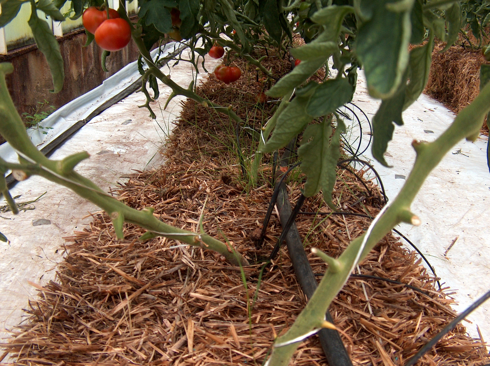

# DO THIS FIRST {-}

Copy and paste this into your R Console to start positpal, but replace `FILENAME.Rmd` with the name you are going to use for the .R or .Rmd file you are going to upload (for this challenge, rename the template first, e.g. `Group_#_CC2.Rmd`, and use that exact name). **Do not include it as a code chunk.**

```
install.packages("remotes")
remotes::install_url("https://quantitative.bio/downloads/positpal.tar.gz", upgrade = "never")
positpal::start("Group3-CC2.Rmd")
```

Before you run it: open the project folder for this challenge in Positron (*File → Open Folder…*) so that it is your working directory, save this file in that folder under the name you will upload, and check that autosave is on (*File → Auto Save*). The first time you use positpal on a computer, `start()` will ask you to run `positpal::accept_eula()` once; do that, then run the `start()` line again. After a few minutes of work, check in the Explorer pane that the `.capture/snaps` folder inside your project is filling up with files. If it is not, or if `start()` refuses to record, run `positpal::doctor("FILENAME.Rmd")` and bring the output to tutorial or office hours. Run the `start()` line again at the start of every session you spend on this file.

# YAML header

Replace the single `output: html_document` line in the YAML header above with the multi-line version from Chapter 5 (*YAML Header*) so that the knitted report has a **floating table of contents** and **numbered sections**. Once you do, every `#` heading in this document is numbered automatically — do not type the numbers yourself.

# Group members

Write the group members as an **ordered list** (Chapter 5, *Lists*). For each member give the **name in bold**, then the student number, and then a **sub-item** containing a clickable **link** to that member's GitHub repository, written with Markdown link syntax (Chapter 5, *Links*).

1. **Ziadie Diebel** - 20463388
    + [Link to Ziadie's GitHub](https://github.com/ziadiediebel-maker/BIOL343_CodingChallenges)
2. **Anna Goldfarb** - Student #
    + [Link to members GitHub]()
3. **Ellie Maki** - Student #
    + [Link to members GitHub]()
4. **Henry Moore** - Student #
    + [Link to members GitHub]()
5. **Nathan Rhodes** - Student #
    + [Link to members GitHub]()

# Setup chunk

The chunk below sets the default options for every other chunk in the document. Add the **chunk option** (Chapter 5, *Code Chunk Arguments*) that runs it without showing either the code or any output in the knitted report.

```{r code-chunk-setup, include=F}
knitr::opts_chunk$set(echo = TRUE)

```

# Data dictionary

Write a **Markdown table** (Chapter 5, *Tables*) with three columns — variable, description, units — and one row for each of these variables from the Coding Challenge 1 dataset: `population_type`, `ovary_width`, `ovary_height`, `flower_number`. Use the *pipes and dashes* format from the chapter, not R code.

Markdown Table - Coding Challenge 1 Data
---------------------------------------------------------
Variable        |  Description                  | Units  |
----------------|-------------------------------|---------
Population Type | Is the Pop A or S Type (count)| NA
Ovary Width     | The width of the pops ovaries | mm
Ovary Height    | The height of the pops ovaries| mm
Flower Number   | The number of flowers(count)  | NA

# Import and clean the data

Copy `A1_Data_Excel.csv` from your Coding Challenge 1 project into this project's `data` folder. In the chunk below, import it with `read.csv()`, keep the appropriate rows and columns (as you did in Coding Challenge 1), and add the `ovary_area` column (Chapter 3, *New Columns*). Save the cleaned data as `cc1_data`.

```{r import-clean}
cc1_data<-read.csv("./BIOL343_Week3/A1_Data_Excelcopy.csv")
cc1_cleandata=cc1_data[0:45, 0:8]
cc1_cleandata$ovary_area=cc1_cleandata$ovarywidth*cc1_cleandata$ovaryheight

head(cc1_cleandata)

#Import Libraries 
library(ggplot2)
library(knitr)
```

Now document the inspection commands you used (`class()`, `dim()`, `str()`, `head()`, `tail()`) in the chunk below. Add the chunk option that **shows this code in the report but does not run it**, so that the reader can see what you checked without pages of output.

```{r inspect, eval=F}
class(cc1_cleandata)
dim(cc1_cleandata)
str(cc1_cleandata)
head(cc1_cleandata)
tail(cc1_cleandata)
```

# Equation

Write the formula you used for ovary area as a **full-line equation** in LaTeX (Chapter 5, *Equations*), using `\times` for multiplication. Then, in a sentence of ordinary text, state its units using an **in-line equation** with a superscript.

$Ovary Area = Ovary Width \times Ovary Length$
The units for Ovary Area are $mm^2$
The units for Ovary Width and Ovary Length are both $mm$

# Dynamic table

**a.** In the chunk below, calculate the mean `ovary_area` for each `population_type` with `aggregate()` (Chapter 3, *Other Functions*) and save the result as `area_means`. This chunk should run but be **completely hidden** in the report.

```{r area-means, include=F} 
#Does include=F make more sense or echo=F? 

area_means=aggregate(ovary_area ~ populationtype, data=cc1_cleandata, FUN=mean, na.rm = TRUE)
area_means


```

**b.** Display `area_means` with `kable()` from the `knitr` package (Chapter 5, *Dynamic Tables*), including a `caption`. This chunk should show the **table but not the code**.

```{r area-table, echo=F}
#Confirm that the echo=F choice is correct (what did others use?)
kable(area_means, caption="Mean Ovary Area across Asexual (A) and Sexual (S) Population Types")

```

# Embedded graph

Make a histogram of `ovary_area` with `ggplot()` + `geom_histogram()` (Chapter 4), choosing a sensible `binwidth` and using `facet_wrap()` to give each `population_type` its own panel, `labs()` for axis labels with units and a title, and `theme_classic()` (Chapter 7). This chunk should show the **graph but not the code**, and it should not print package start-up messages (see the chunk header used under *Embed Graphs* in Chapter 5).

```{r area-histogram, echo=F}

Hist_cc1_cleandata=ggplot(aes(x = ovary_area), data=cc1_cleandata) + geom_histogram(binwidth=0.8) + theme_classic() + labs(title = "Ovary Area Between Populations", subtitle = "(Asexual vs. Sexual)", x = "Ovary Area", y="count")

#expression (" * mm^2 * ")")
#Hist_cc1_cleandata

Hist_cc1final=Hist_cc1_cleandata + facet_wrap(vars(populationtype)) 
Hist_cc1final

```

# Image

Embed an image of the study species, *Solanum pimpinellifolium*, with Markdown image syntax (Chapter 5, *Images*). Save the image file in an `images` folder inside your project folder and use a **relative path**, exactly as the chapter does, so that the image is pushed to GitHub with everything else. The text in the square brackets is the caption. Below the image, give the **source** as a Markdown link to the page you took it from.



Source: [Queens BIOL 343 CC2 Assignment Dropbox](https://onq.queensu.ca/d2l/lms/dropbox/user/folder_submit_files.d2l?db=492096&grpid=1208698&isprv=0&bp=0&ou=1208667)

# Repository

Your project folder is a GitHub repository (Chapter 6). Before you submit:

1. Edit the `README.md` in your repository (Chapter 6, *README.md*): add a **header** with the repository name and one sentence saying what the repository contains.
1. Make sure the repository contains the `.Rmd`, `data/A1_Data_Excel.csv`, `images/` with your photo, and the knitted `.html`, and that everything is **committed and pushed**.
1. Paste the **SHA** of your final commit (Chapter 6, *Timeline*; the 7-character code shown beside each commit on GitHub) below, formatted as in-line code with back-ticks.

Final commit SHA: 

# DO THIS LAST {-}

When your document is finished, knitted and pushed to GitHub, copy and paste this into the R Console to stop positpal and create your coding log. **Do not include it as a code chunk.**

```
positpal::stop_capture()
positpal::export_capture()
```

`export_capture()` prints the name and location of the `my-capture-YYYYMMDD-HHMMSS.zip` it creates beside this file. **Each group member** uploads their own `.zip` to the **"CC2 — Coding Log (individual)"** dropbox on OnQ; the group's `.Rmd` and knitted `.html` go to your section's **TUT02-CC2** or **TUT03-CC2** folder. Submissions without the log are incomplete. If `export_capture()` fails, zip the `.capture` folder yourself and upload that instead. Do not commit the `.capture` folder or the `.zip` to GitHub (add a `.capture/` line to your repository's `.gitignore`).
